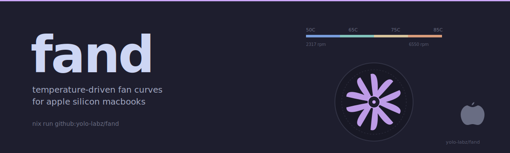

<picture>
  <source media="(prefers-color-scheme: dark)" srcset="docs/assets/hero-dark.svg">
  <source media="(prefers-color-scheme: light)" srcset="docs/assets/hero-light.svg">
  
</picture>

# fand

**Pattern.** Temperature-driven fan curve daemon for Apple Silicon MacBooks (M1–M5). A single-threaded control loop reads SMC sensors, applies per-fan curves with EMA smoothing and hysteresis, and drives `F0md` (forced-minimum vs auto) on the AppleSMC.

**Trade-off.** Exact-pinned dependencies and a reproducible nix build over `cargo update` flexibility — the reasoning is that SMC writes are safety-critical (thermal hazard if two daemons race for the keyspace, or if a stale curve survives a config reload) and silent crate skew is the failure mode worth foreclosing first.

**Use when.** macOS thermal management needs aggressive cooling curves on demand without iStat Menus / Macs Fan Control GUI overhead, declaratively configured via nix-darwin, with single-instance enforcement and a panic-temp override that survives sensor faults.

```bash
nix run github:yolo-labz/fand                       # one-shot build + status
sudo fand validate --config /etc/fand.toml          # config gate
sudo fand run --config /etc/fand.toml               # foreground daemon
```

> **SMC reality.** On Apple Silicon M-series, the SMC only accepts `F0md=0` (auto) and `F0md=1` (forced minimum). Arbitrary RPM targets are read-only. The daemon's curve output reduces to a binary decision per tick: if the curve says RPM near hardware minimum → forced minimum; otherwise → auto (`thermalmonitord` manages from there). See [RD-08](docs/SMC-PROTOCOL.md) for the protocol derivation.

## Demo

A non-interactive 24-second `asciinema` cast covering `fand --help`, `fand status`, `fand show`, `sudo fand keys`, `fand validate`, and `sudo fand reload` is checked into the repo at [`docs/assets/fand-demo.cast`](./docs/assets/fand-demo.cast). Replay locally:

```bash
asciinema play docs/assets/fand-demo.cast
```

A hosted player embed will land in a follow-up PR after the cast is uploaded to `asciinema.org`.

## How `fand` compares

Closest peers in the macOS thermal-management ecosystem:

| Capability                              | `fand` (this repo) | [Macs Fan Control](https://crystalidea.com/macs-fan-control) | [iStat Menus](https://bjango.com/mac/istatmenus/) |
|-----------------------------------------|:---:|:---:|:---:|
| nix-darwin LaunchDaemon module          | yes | no (GUI installer)               | no (commercial installer)         |
| Headless daemon (no GUI required)       | yes | GUI required                     | GUI required                      |
| Apple Silicon SMC writes (`F0md`)       | yes | yes                              | yes                               |
| SLSA L2 + dual SBOM + Sigstore          | yes | no                               | no                                |
| Open source                             | MIT | donationware (closed source)     | commercial license                |
| `loom` + `miri` concurrency tested      | yes | no                               | no                                |
| Exact-pinned reproducible build         | yes | no                               | no                                |
| Single-instance flock enforcement       | yes | no                               | no                                |
| Panic-temp override + hold              | yes | manual config                    | manual config                     |
| TOML config + signal-driven reload      | yes | no (GUI)                         | no (GUI)                          |

For Intel-era SMC tooling see [`smcFanControl`](https://github.com/hholtmann/smcFanControl) — different SMC contract (`Fx*` RPM writes), not portable to Apple Silicon.

## Installation

### Via nix-darwin (recommended)

Add fand as a flake input and enable the module:

```nix
# flake.nix
{
  inputs = {
    nixpkgs.url = "github:NixOS/nixpkgs/nixpkgs-25.05-darwin";
    nix-darwin.url = "github:LnL7/nix-darwin";
    fand.url = "github:yolo-labz/fand";
  };

  outputs = { self, nixpkgs, nix-darwin, fand, ... }: {
    darwinConfigurations.macbook-pro = nix-darwin.lib.darwinSystem {
      system = "aarch64-darwin";
      modules = [
        fand.darwinModules.default
        {
          services.fand = {
            enable = true;
            settings = {
              config_version = 1;
              poll_interval_ms = 500;
              log_level = "info";
              fan = [{
                index = 0;
                sensors = [{ smc = "Tf04"; } { smc = "Tf09"; } { smc = "Tf0D"; }];
                hysteresis_up = 1.0;
                hysteresis_down = 2.0;
                smoothing_alpha = 0.25;
                ramp_down_rpm_per_s = 600;
                panic_temp_c = 95.0;
                panic_hold_s = 10;
                curve = [
                  [50 2317]   # below 50C: hardware minimum
                  [65 3500]   # moderate load
                  [75 5000]   # heavy load
                  [85 6550]   # thermal emergency: hardware maximum
                ];
              }];
            };
          };
        }
      ];
    };
  };
}
```

Then `darwin-rebuild switch` deploys the daemon.

### Manual build

```bash
cargo build --release
./scripts/sign-release.sh  # optional: ad-hoc codesign with hardened runtime
sudo cp target/release/fand /usr/local/bin/
```

### Via nix build

```bash
nix build github:yolo-labz/fand
result/bin/fand --version
```

## Configuration

fand reads `/etc/fand.toml` (or the path given by `--config`). The schema:

```toml
config_version = 1
poll_interval_ms = 500     # tick interval: 100-5000 ms
log_level = "info"         # error | warn | info | debug

[[fan]]
index = 0                  # SMC fan index (0-based)
sensors = [{smc = "Tf04"}, {smc = "Tf09"}]  # temperature sensor fourcc keys
hysteresis_up = 1.0        # heating threshold (C)
hysteresis_down = 2.0      # cooling threshold (C)
smoothing_alpha = 0.25     # EMA smoothing factor
ramp_down_rpm_per_s = 600  # max RPM decrease per second
panic_temp_c = 95.0        # emergency: ramp to max above this
panic_hold_s = 10          # hold max RPM for this long after panic
curve = [                  # [temperature_C, RPM] breakpoints
  [50.0, 2317],
  [65.0, 3500],
  [75.0, 5000],
  [85.0, 6550],
]
```

## Discovering Sensors

Sensor key names differ between Apple Silicon generations:

| Generation | P-core prefix | E-core prefix | Example |
|-----------|--------------|--------------|---------|
| M1 | `Tp0*` | `Tp0*` | `Tp01`, `Tp05` |
| M2 | `Tp0*` | `Tp1*` | `Tp01`, `Tp1h` |
| M3 | **`Tf0*`/`Tf4*`** | `Te0*` | `Tf04`, `Te05` |
| M4 | `Tp0*` | `Te0*` | `Tp01`, `Te05` |
| M5 | `Tp0*` | `Tp0*` | `Tp0O`, `Tp0R` |

Find your machine's sensors:

```bash
sudo fand keys --all | grep '^T'     # list all temperature keys
sudo fand keys --read Tf04           # read a specific sensor
```

## Commands

```bash
fand run --config /etc/fand.toml              # persistent daemon
fand run --config test.toml --dry-run         # print planned writes
fand run --config test.toml --dry-run --json  # JSONL output
fand run --config test.toml --once            # single tick, then exit
fand curve --config test.toml --fan 0         # ASCII curve plot
fand set --fan 0 --rpm 2317 --commit          # one-shot write
fand selftest --iterations 5                  # round-trip verification
fand keys                                     # read fan metadata
fand keys --all                               # enumerate all SMC keys
```

## Security

- **Codesign**: ad-hoc signed (no Apple Developer ID). The nix store hash is the trust anchor.
- **Threat model**: see [`docs/SECURITY.md`](docs/SECURITY.md) and [`specs/005-smc-write-roundtrip/threat-model.md`](specs/005-smc-write-roundtrip/threat-model.md)
- **Supply chain**: cargo-vet attestations in `supply-chain/audits.toml`, cargo-deny policy in `deny.toml`
- **Verify provenance**: `gh attestation verify ./fand-aarch64-darwin --owner yolo-labz`

## Contributing

```bash
nix develop                  # dev shell with Rust + tools
cargo test                   # run all tests
cargo clippy -- -D warnings  # lint
```

## License

MIT — see [LICENSE](LICENSE).

---

## Services

Compliance-grade AI architecture for regulated workloads — async-first, USD-denominated, LATAM-based / EN-fluent. See [blog.home301server.com.br/services](https://blog.home301server.com.br/services/).
